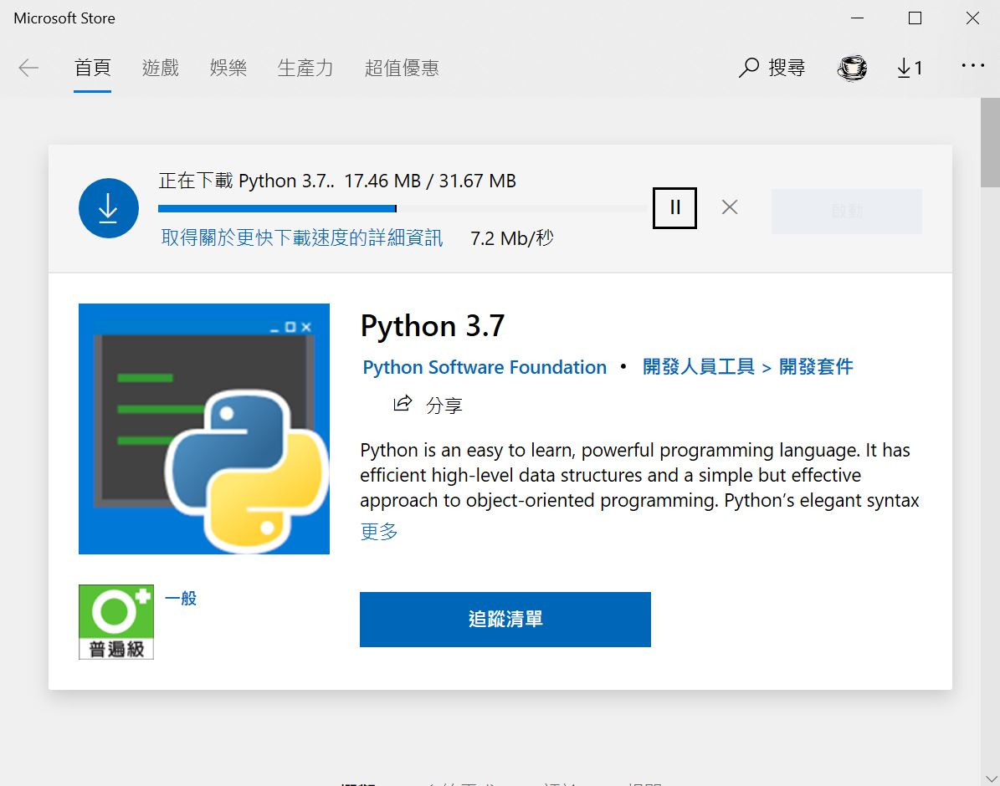
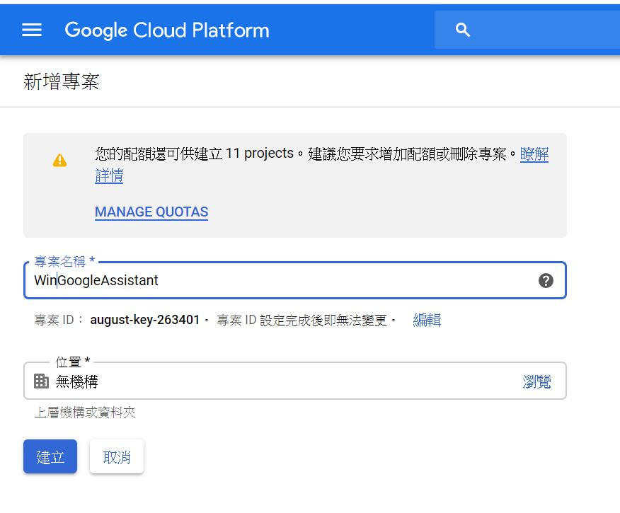
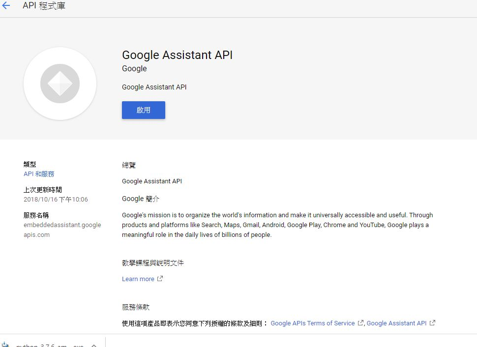
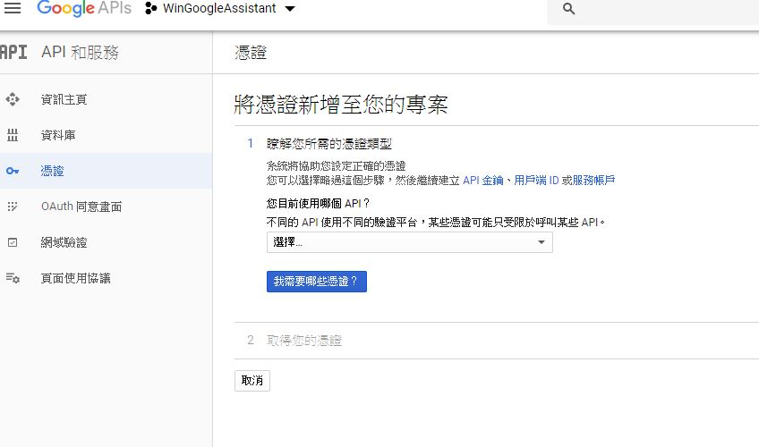
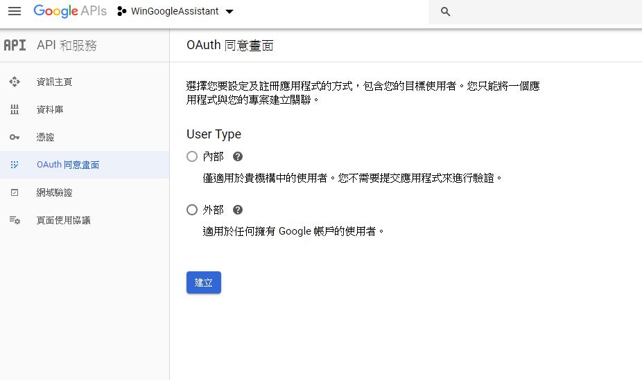
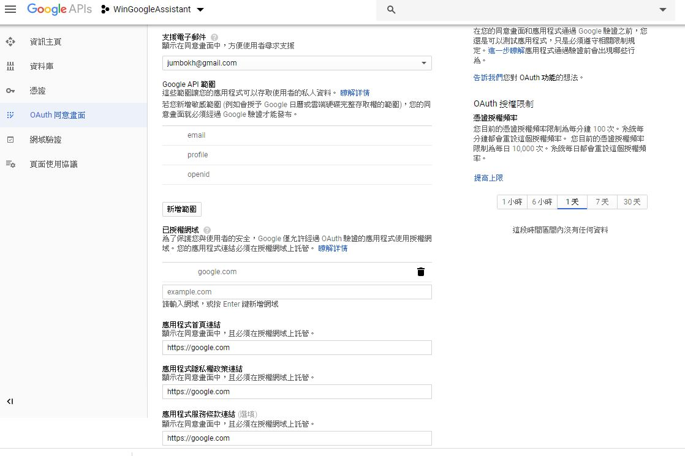

## 在 WIN10 PC 上安裝 Google Assistant 
### STEP1. 下載並安裝 python 3.7.6
* [下載頁面](https://www.python.org/downloads/windows/)
#### [下載 python3.7 : Download Windows x86-64 executable installer](https://www.python.org/ftp/python/3.7.6/python-3.7.6-amd64.exe)
#### 或是: 
### STEP 2. 開啟 windows 檔案總管，建立新目錄，如: D:\GoogleAssistant
### STEP 3. 註冊/登入 [Google Cloud Plateform](https://cloud.google.com)
### STEP 4. 建立新專案: WinGoogleAssistant

### STEP 5. 開啟 [Google Assistant API](https://console.developers.google.com/apis/api/embeddedassistant.googleapis.com/overview)
####        啟用 : Google Assistant API

### STEP 6. 選擇建立憑證

### STEP 7. 在建立憑證頁面中選擇:
* 憑證類型: Google Assistant API
* API 呼叫來源: 其他使用者介面(例如 Windows、CLI工具)
* 你需要存取什麼資料: 使用者資料
* 選擇: 我需要那些憑證
#### 設定 OAuth 畫面
### STEP 8. 設定同意畫面
### STEP 9. 選擇 User Type

* 內部 (G-suit 使用者 ) ==> 可直接按 SAVE
* 外部 : 建立憑證

* 1. 應用程式名稱: WinGoogleAssistant-01
* 2. 支援電子郵件: <your@mail>
* 3. 已授權網域: <your.domain> or google.com
* 4. 應用程式首頁連結: <https://your.domain> or https://google.com
* 5. 應用程式隱私權政策連結: <https://your.domain> or https://google.com
* 6. 應用程式服務條款連結: <https://your.domain> or https://google.com
### STEP 10. 建立憑證==> 請幫我選擇 (其他選項同 STEP7) ==> 將憑證新增至您的專案 
### STEP 11. 輸入名稱: WGACrentials1 ==> 建立 OAuth 用戶端 ID
### STEP 12. 選擇 ==> 下載憑證 ==> 完成
### STEP 13. 複製 client_id.json (剛剛下載的憑證) 至 STEP2 所建立的目錄
### STEP 14. [開啟 windows 命令視窗](https://www.lifewire.com/how-to-open-command-prompt-2618089)
###          輸入: python -m pip install google-assistant-sdk[samples]
### STEP 15. 輸入: python -m pip install --upgrade google-auth-oauthlib[tool]
###          輸入: python -m pip install --upgrade pip
### STEP 16. 將 google-assistant 安裝路徑設定至 windows path 環境變數中, 如:
<pre>
c:\Users\benq4\AppData\Local\Packages\PythonSoftwareFoundation.Python.3.7_qbz5n2kfra8p0\LocalCache\local-packages\Python37\Scripts
</pre>
### STEP 17. 複製檔案名稱 (client_id.json)  (因為有時產生的檔名很長)
### STEP 18. 回 windows 命令視窗
### 輸入: 
<pre>
google-oauthlib-tool --client-secrets D:\GoogleAssistant\client_id.json --scope https://www.googleapis.com/auth/assistant-sdk-prototype --save --headless
</pre>
### STEP 19. 複製視窗中顯示的授權要求頁面路徑
### STEP 20. 開啟授權要求頁面，並選擇欲授權的使用者
### STEP 21. 於下一個頁面中按 允許
### STEP 22. Google 會給一段授權碼， 將其複製，然後轉至 Windows命令視窗
### STEP 23. 貼上授權碼，將會儲存一個憑證檔案至系統中
### STEP 24. 測試。
###          輸入: python -m googlesamples.assistant.grpc.audio_helpers
### STEP 25. 取得 STEP4 中建立的專案 id， 如: august-key-263401
###          於 windows指令 視窗中，輸入:
* cd d:\GoogleAssistant
<pre>
googlesamples-assistant-devicetool --project-id august-key-263401 register-model --manufacturer “Assistant SDK developer” --product-name “Assistant SDK light” --type LIGHT --model “GAHOME-01”
</pre>
### STEP 26. 測試 push to talk
###          於 windows指令 視窗中，輸入:
* cd d:\GoogleAssistant
<pre>
python -m googlesamples.assistant.grpc.pushtotalk --device-model-id “GAHOME-01” --project-id august-key-263401
</pre>

