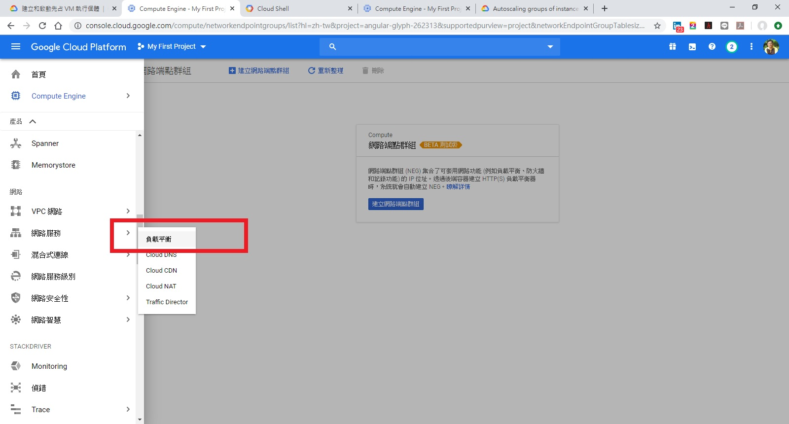
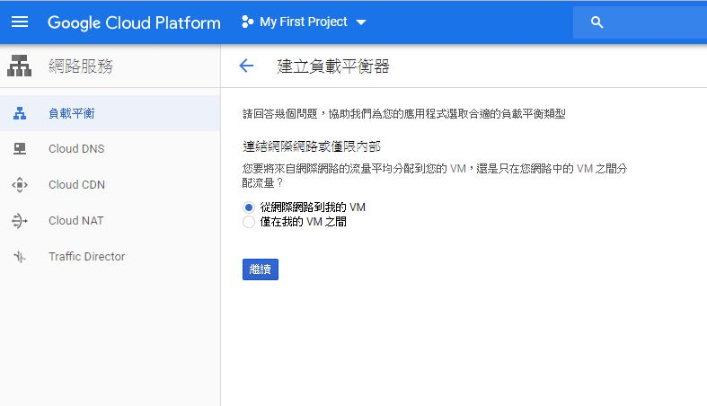
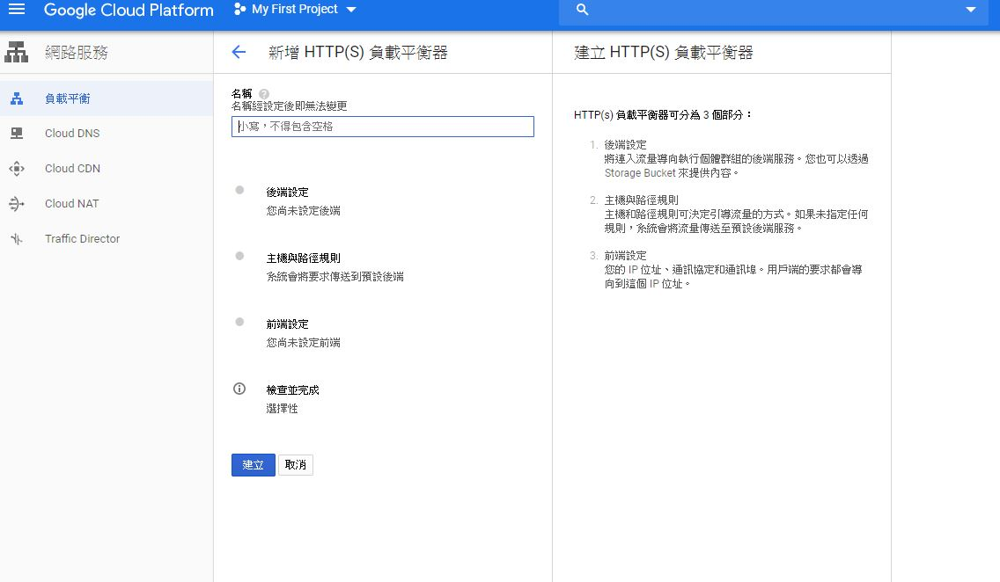
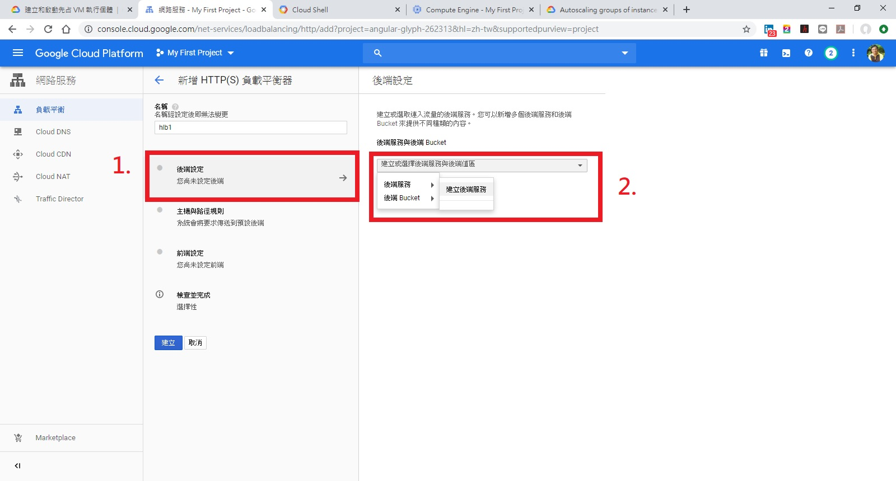
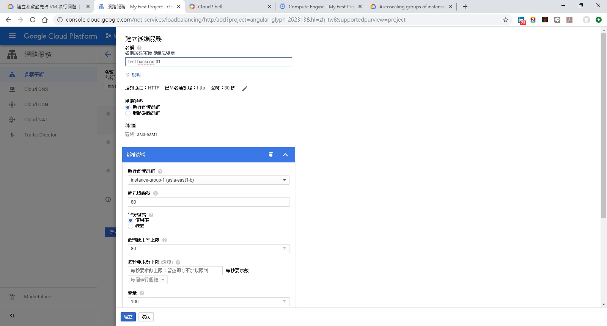
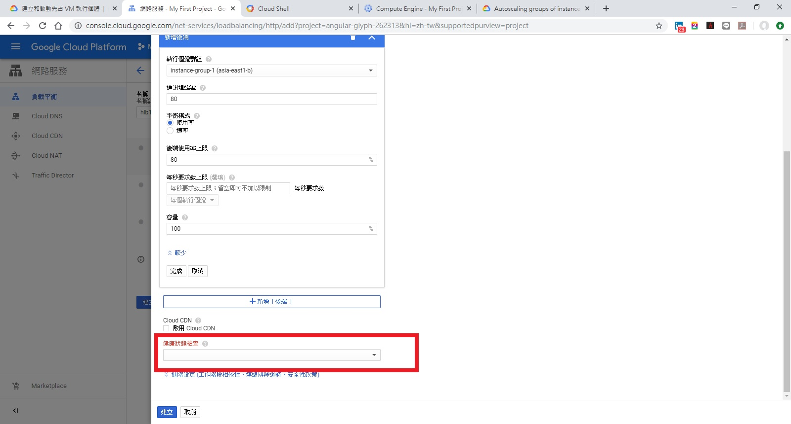
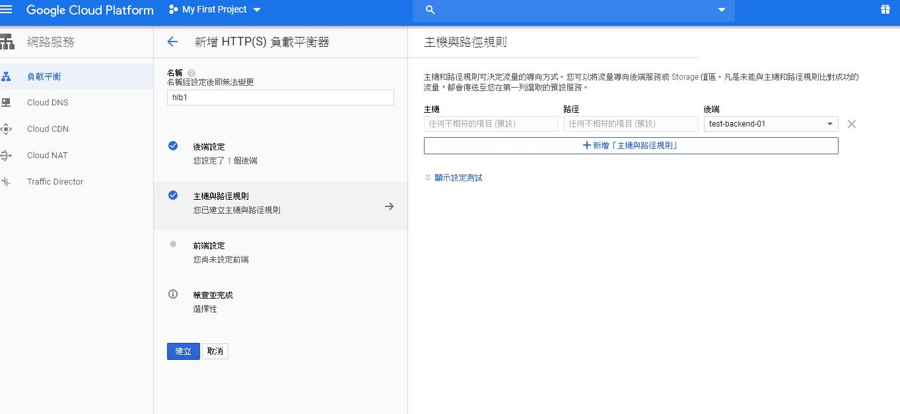
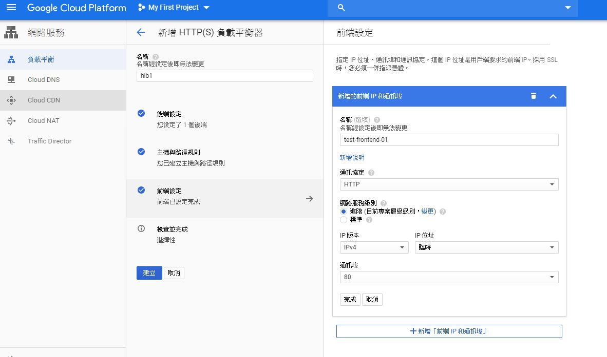
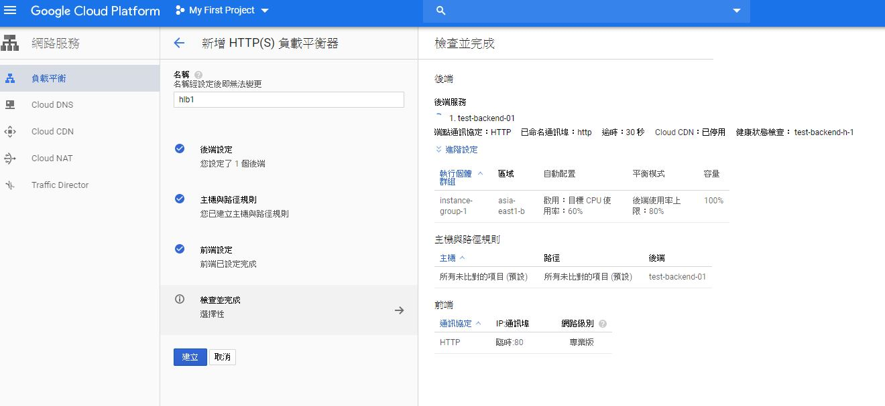

## [HTTP(S) 負載平衡概念](https://cloud.google.com/load-balancing/docs/https/?hl=zh-TW)

### 建立自己的 image
#### 以 Debian 為例
#### show available images
<pre>
gcloud compute images list
</pre>
<pre>

gcloud beta compute instances create instance-2 \
  --zone=asia-east1-b \
  --machine-type=n1-standard-1 \
  --subnet=default \
  --network-tier=PREMIUM \
  --maintenance-policy=MIGRATE \
  --service-account=865148399496-compute@developer.gserviceaccount.com \
  --scopes=https://www.googleapis.com/auth/devstorage.read_only,https://www.googleapis.com/auth/logging.write,https://www.googleapis.com/auth/monitoring.write,https://www.googleapis.com/auth/servicecontrol,https://www.googleapis.com/auth/service.management.readonly,https://www.googleapis.com/auth/trace.append \
  --tags=http-server,https-server --image=debian-10-buster-v20191210 \
  --image-project=debian-cloud \
  --boot-disk-size=10GB \
  --boot-disk-type=pd-standard \
  --boot-disk-device-name=instance-2 \
  --reservation-affinity=any
</pre>
<pre>
 gcloud compute ssh instance-2 --zone asia-east1-b
 
 sudo su -
 apt-get update -y && apt-get install nginx -y
 runlevel
 </pre>
 #### 確定 nginx 再重開時可以自動執行
 <pre>
 ls -l /etc/rc5.d/
 reboot
 </pre>
 #### 設定該主機刪除時，把硬碟留下來
 <pre>
 gcloud compute instances set-disk-auto-delete instance-2 \
  --no-auto-delete \
  --disk instance-2 \
  --zone asia-east1-b
 </pre>
 #### 刪除主機，然後透過該硬碟製作 image
 <pre>
 gcloud compute instances delete instance-2 --zone asia-east1-b -q
 </pre>
 #### 接下來針對卸載的硬碟製作 image
 <pre>
 gcloud compute images create myimage --source-disk instance-2 \
  --source-disk-zone asia-east1-b
 </pre>
 ### 建立 instance template
 <pre>
gcloud compute instance-templates create "instance-template-1" \
 --machine-type "n1-standard-1" \
 --network "default" \
 --image "myimage1" \
 --tags "http-server","https-server" \
 --boot-disk-size "10" \
 --boot-disk-type "pd-standard" \
 --boot-disk-device-name "instance-template-1"
 </pre>
 ### 建立 instance group
 <pre>
gcloud compute instance-groups managed create instance-group-1 \
 --base-instance-name=instance-group-1 \
 --template=instance-template-1 \
 --size=1 \
 --zone=asia-east1-b

gcloud beta compute instance-groups managed set-autoscaling "instance-group-1" \
 --zone "asia-east1-b" \
 --cool-down-period "60" \
 --max-num-replicas "10" \
 --min-num-replicas "1" \
 --target-cpu-utilization "0.6" \
 --mode "on"
 </pre>
## 建立 HTTP(S) Load Balancer
### STEP1 選擇 網路服務=>負載平衡

### STEP2 幫你的 HTTP(S) Load Balancer 命名後， 點選 Backend 中的 "Create or select a backend service"

### STEP3 設定 backend detail -- Health Check、Session affinity

### STEP4 設定 Host 與 Path Rule

### STEP5 設定 Frontend : Port 、 IP

### STEP6 確認後送出建立

